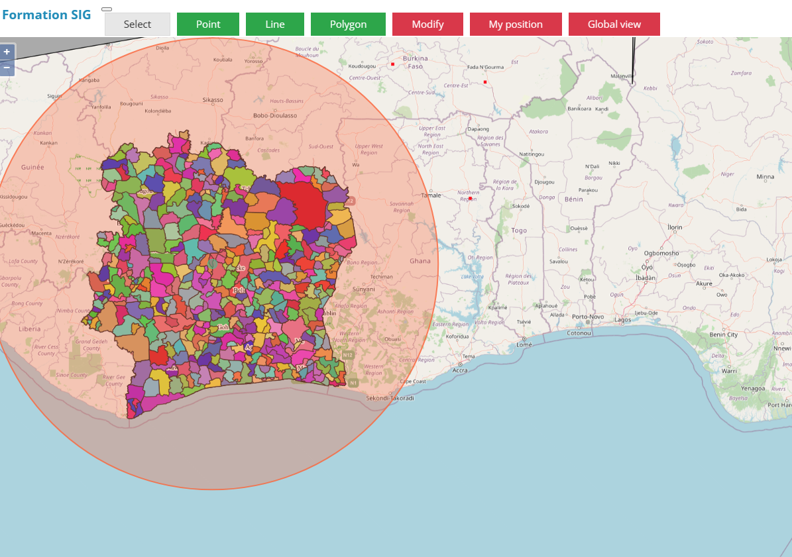
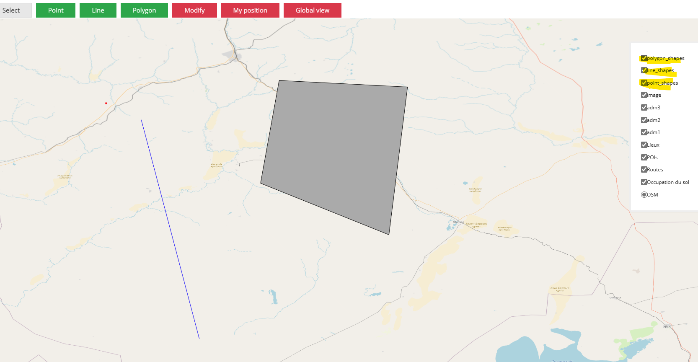
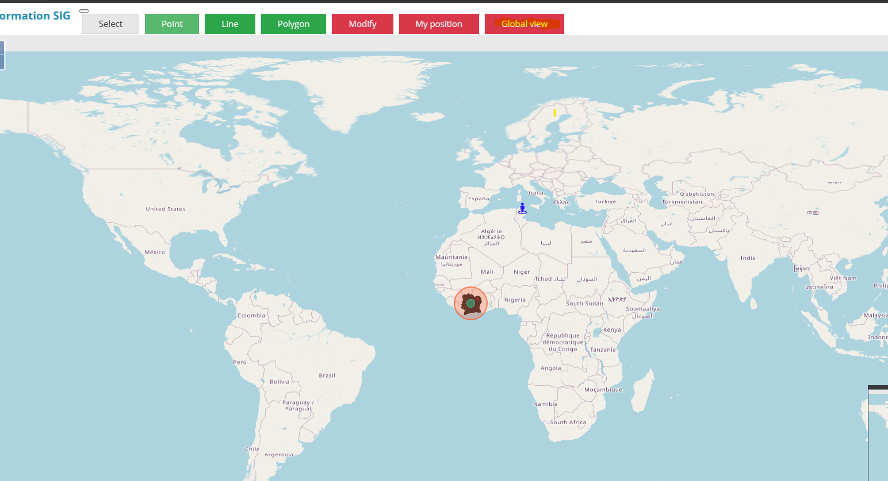
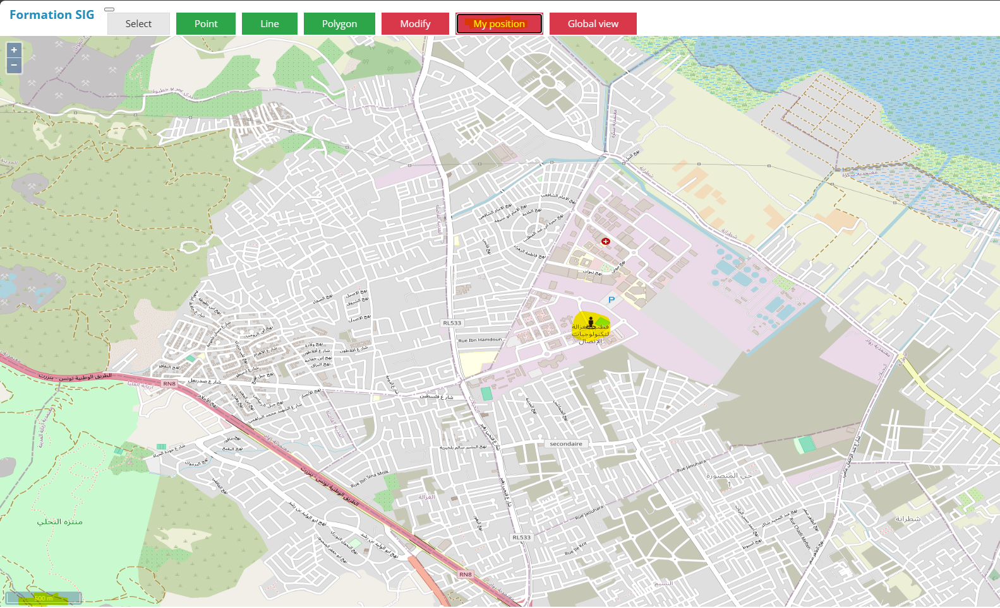

# OpenLayers Project 

Welcome to the OpenLayers Project! 🚀 To get started, follow the steps below:

## Prerequisites ✈
Make sure you have **npm** and **Node.js** installed on your system. 
You will need also to run geoserver and complete the work related to the layers.

## Setting up the Server 🌍
1. Navigate to the `server` directory.
2. Run the following commands:
   ```bash
   npm install
   node service.js
## PostgresSQL Configuration ⭐
Ensure that PostgreSQL is running on the same port as specified in the code.

For the PostgreSQL tables, you don't need to worry; the code will handle their creation. Just prepare the database and pass the credentials into the code.

## Screenshots 📸

1. **OpenLayers Map with GeoServer Layers**
   

2. **Displaying Shapes Existing in the Database**
   

3. **Displaying the Global View of the Map**
   

4. **Displaying the local position**
   
